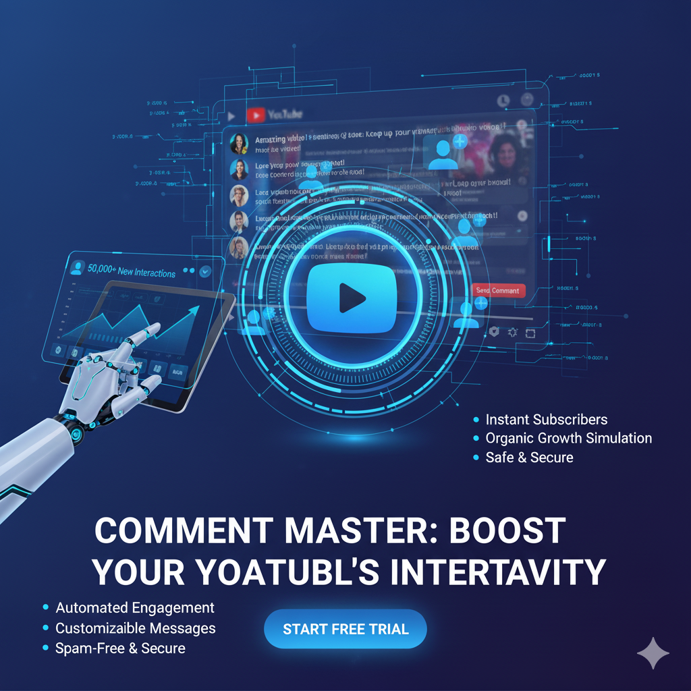

# youtube comment bot bot

Automate YouTube comment posting and moderation at scale. This repo streamlines account/session handling, safe pacing, and proxy rotation so you can schedule or batch-post comments reliably.

<p align="center"> 
  <a href="https://github.com/yourusername/youtube%20bot%20comments">
    
  </a> 
</p>

<p align="center">
  <a href="https://discord.gg/vBu9huKBvy">
    
  </a>
  <a href="https://t.me/devpilot1">
    
  </a>
</p>

## Introduction
**youtube bot comments** helps teams, creators, and growth engineers automate compliant, human-like comment workflows: scheduled drops, reply chains, templated spins, and basic moderation. Designed for reliability with headless browser control, cookie-based sessions, and optional proxy pools.

**Key Benefits**
- **Time-saving:** batch posts, schedules, and templates reduce manual effort.
- **Scalable:** multi-profile execution with per-profile cookies & proxies.
- **Safer:** human-like pacing, jitter, and backoff to lower risk signals.

## Features
- Playwright/Selenium workers with session reuse (cookies.json per profile)  
- Comment templates with `{spintax|variants}` and variable injection  
- Schedules & queues (FIFO) with jittered delays to mimic humans  
- Per-task proxy assignment + automatic retries & exponential backoff  
- CSV/JSON input for targets (video/channel/community URLs)  
- Reply threads (comment → reply → nested reply) with depth limits  
- Optional headful preview mode + HTML run reports  

<p align="center">
  
</p>


<p align="center">
  <a href="https://www.loom.com/share/b7734cf1455f4c018e469ee18a821c72" target="_blank" rel="noopener noreferrer">
    
  </a>
</p>
<p align="center">
  <a href="https://www.loom.com/share/b7734cf1455f4c018e469ee18a821c72" target="_blank" rel="noopener noreferrer">
    Click here to see the demo video
  </a>
</p>

## Use Cases
- Seed early engagement under new uploads  
- Maintain campaign reply threads across time zones  
- Moderate or replace filtered comments via watchlists  
- A/B test message variants for CTR and sentiment  
- Agency workflows across many client channels  

## Contact
<p align="center">
  <a href="https://discord.gg/vBu9huKBvy">
    
  </a>
  <a href="https://t.me/devpilot1">
    
  </a>
</p>

## Installation Instructions

### Pre-requisites
- **Python** 3.10+ (for the Python worker)  
- **Node.js** 18+ (for the Node worker/CLI)  
- **Docker** (optional, for one-command runs)  
- **Chromium/Chrome** auto-installed by Playwright  
- Recommended: proxy provider & separate cookies per profile  

### Clone
```bash
git clone https://github.com/yourusername/youtube-bot-comments.git
cd youtube-bot-comments


